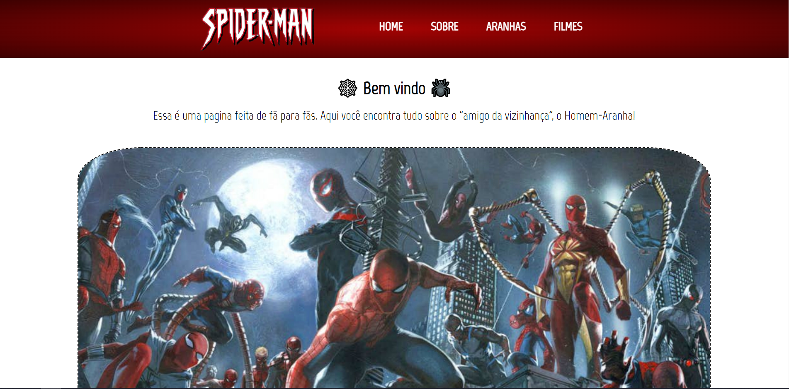
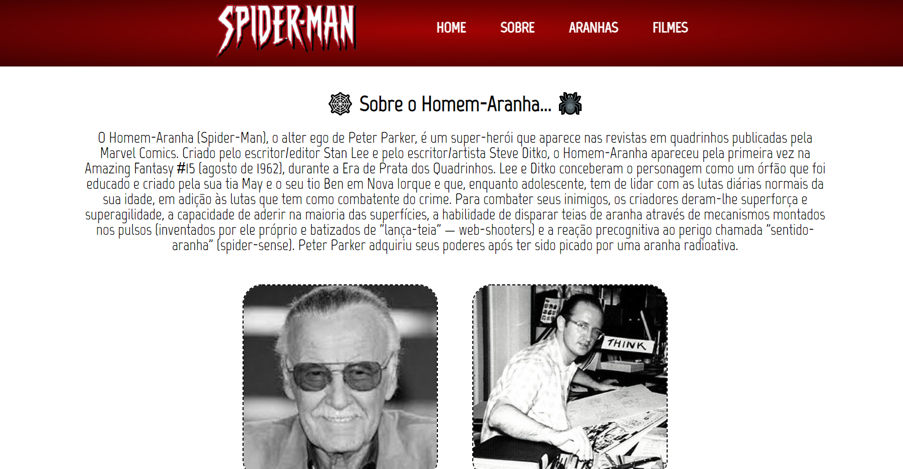

    

 <a href="https://brunosabbagmachado.github.io/spidermanFanPage/">Fan Page</a> do Homem-Aranha criada para colocar em prática conhecimentos em HTML e CSS.

    

**Acesse o projeto clicando [aqui](https://brunosabbagmachado.github.io/spidermanFanPage/).**

# Tabela de conteúdos
<!--ts-->
   * [Sobre](#Sobre)
   * [Explicação](#Explicação)
   * [Projeto](#O-Projeto)
<!--te-->

# Sobre

Fan Page do Homem-Aranha criada apenas com intuito de estudar, treinar e praticar meus conhecimentos em HTML e CSS.

Todas as imagens utilizadas e textos foram retirados da Internet e os direitos do Homem-Aranha são da Marvel e da Sony.

Não há fins lucrativos nessa página.

O Homem-Aranha sempre foi meu herói favorito. Esse ano retomei meus estudos de Frontend. Para poder relembrar do que aprendi ano passado, resolvi criar esse site. Dessa forma pude por em prática o conhecimento que tenho e ainda aprender mais enquanto construía o projeto.

# Explicação

Em agosto de 2021 comecei meus estudos de programação na **[Alura](https://www.alura.com.br/)**. Estou seguindo a trilha de Frontend. Porém, no final do ano, por certas situações, não consegui continuar meus estudos. Agora, com tudo resolvido, voltei a estudar e precisava relembrar o conteúdo que havia aprendido. Por isso criei esse projeto.

Esse site foi desenvolvido com base nos 4 módulos de HTML5 e CSS3 da Alura, ministrados pelo Professor **[Pedro Marins](https://github.com/pedromarins)**.

Além de seguir os ensinamentos passados nos cursos, também me aventurei e pesquisei na internet várias coisas sobre HTML e CSS, para entender melhor como as coisas funcionam e como usa-las da melhor maneira.

# O Projeto

Esse site possuí quatro páginas:
* [Home](https://brunosabbagmachado.github.io/spidermanFanPage/index.html);
* [Sobre](https://brunosabbagmachado.github.io/spidermanFanPage/HTML/sobre.html);
* [Aranhas](https://brunosabbagmachado.github.io/spidermanFanPage/HTML/aranhas.html);
* [Filmes](https://brunosabbagmachado.github.io/spidermanFanPage/HTML/filmes.html).

# Imagens

     

# Conclusão

O projeto começou no dia **17/01** e foi concluído no dia **24/01**. 

O projeto não está perfeito, mas serviu ao propósito ao qual foi pensado: me ajudar a relembrar e por em prática o aprendizado que adiquiri no ano passado.

